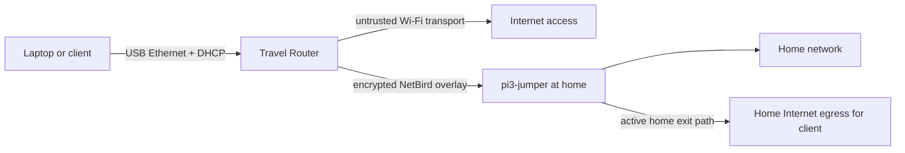

# Travel Router

> **Status:** deployed appliance · **recovery-first** · **no secrets**

Travel Router turns a Raspberry Pi Zero W into a USB-connected network appliance. A laptop can use the Pi as Ethernet while the Pi joins untrusted upstream Wi-Fi, carries traffic through NetBird, reaches the home network through `pi3-jumper`, and uses the home exit path for Internet access.

## Current hardware

- Raspberry Pi Zero W v1.1
- Waveshare 2.7-inch V1 e-Paper HAT
- one USB data/power connection to the client
- Wi-Fi uplink on `wlan0`
- USB Ethernet gadget interface on `usb0`

## Network path

The attached client does not need its own Wi-Fi or NetBird client. The deployed appliance provides a private USB LAN, forwards through NetBird, and depends on `pi3-jumper` for home-network routing, egress, and Jellyfin control relays.

## Physical controls

The e-Paper panel shows cached WAN, VPN, home-route, exit-path, and Jellyfin state. The four fixed buttons perform the deployed actions:

| Key | Gesture | Action |
| --- | --- | --- |
| K1 | short press | wake Jellyfin through `pi3-jumper` |
| K2 | hold about 2 seconds | shut down Jellyfin through `pi3-jumper` |
| K3 | short press | restart NetBird locally |
| K4 | hold about 3 seconds | render `SAFE TO UNPLUG`, then power off |

Only one input is accepted per slow e-Paper refresh. Presses while the panel is busy are discarded, so destructive actions cannot be replayed later.

## Repository map

- [`docs/ARCHITECTURE.md`](docs/ARCHITECTURE.md) — deployed network, display, and control design
- [`docs/RECOVERY.md`](docs/RECOVERY.md) — bounded recovery and reboot acceptance procedure
- [`examples/`](examples/) — safe generic example values and templates for a build-along deployment
- [`config/pi3-jumper/91-netbird-direct-ssh.conf`](config/pi3-jumper/91-netbird-direct-ssh.conf) — required OpenSSH listener drop-in for the control relay

Instance identity and addresses belong in the private `ffworker/infra-configs` record at `hosts/travel-router01/`, not in this reusable appliance repository.

## Restore or rebuild

For a partially working appliance, follow [`docs/RECOVERY.md`](docs/RECOVERY.md): recover the USB profile, confirm DHCP and forwarding, verify NetBird and `pi3-jumper`, then run the client-side and reboot acceptance checks.

A bare-metal rebuild is **not yet fully reproducible from Git**. The deployed Python implementation, USB gadget boot configuration, DHCP configuration, and persistent firewall rules were not present in the source repository and the appliance was unreachable during this extraction. Do not invent replacements or convert working components simply to fill that gap. Recover the appliance from an existing system backup when available, then capture and verify those non-secret files here.

## Recovery philosophy

- restore the last-known-good design before changing architecture;
- inspect current routes and firewall state before adding rules;
- preserve an enrolled NetBird identity unless re-enrollment is necessary;
- verify the router and a USB-only client after reboot;
- treat centrally managed NetBird policy as a separate recovery dependency;
- keep every physical appliance's peer identity unique.

## Security boundary

This repository deliberately excludes Wi-Fi credentials, NetBird setup keys and management tokens, private SSH keys, peer databases, cookies, credential exports, and live environment files. Runtime secrets stay on the appliance or in the approved secret store. The public half of the appliance SSH key may be authorized on `pi3-jumper`; its private half must never enter Git.
